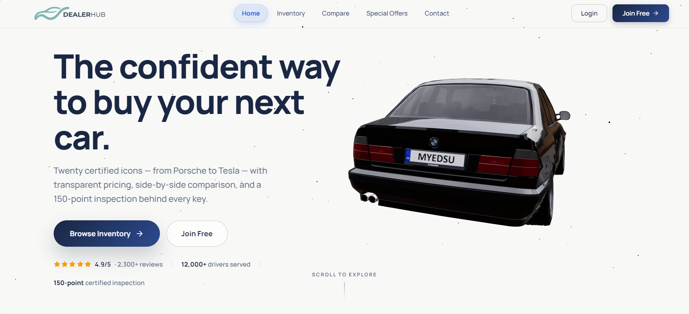
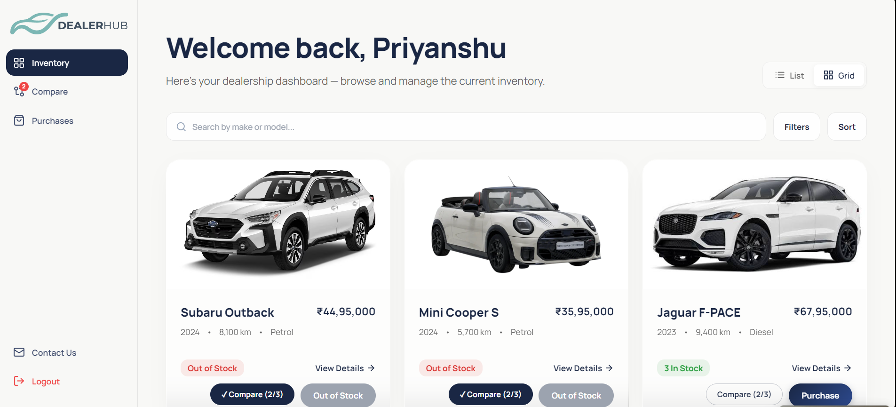
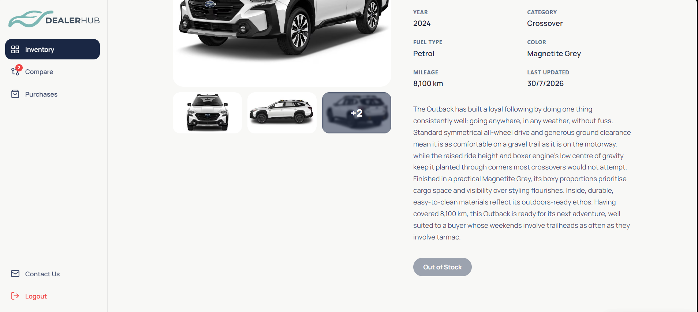
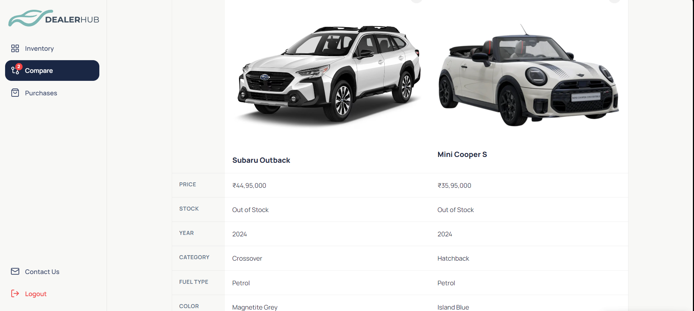
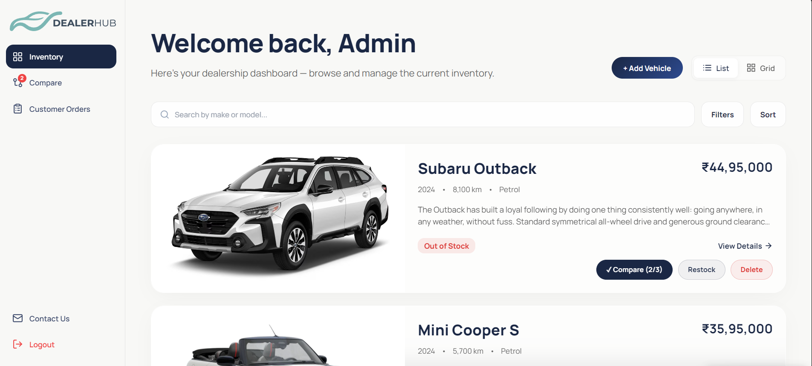
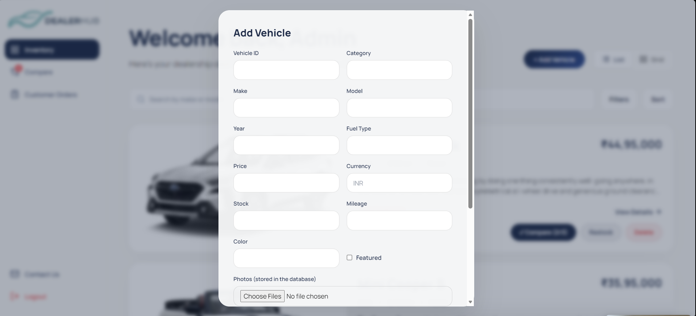
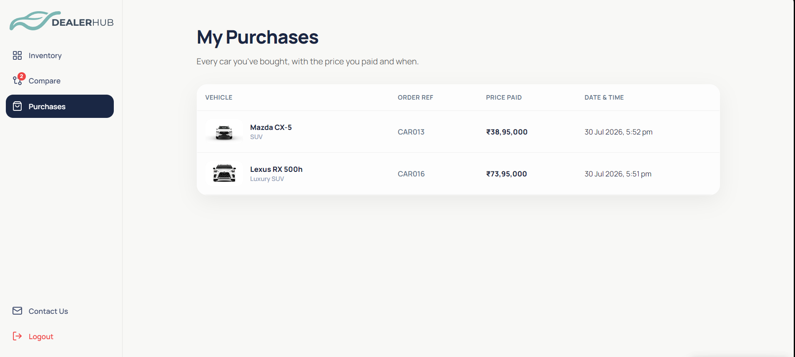
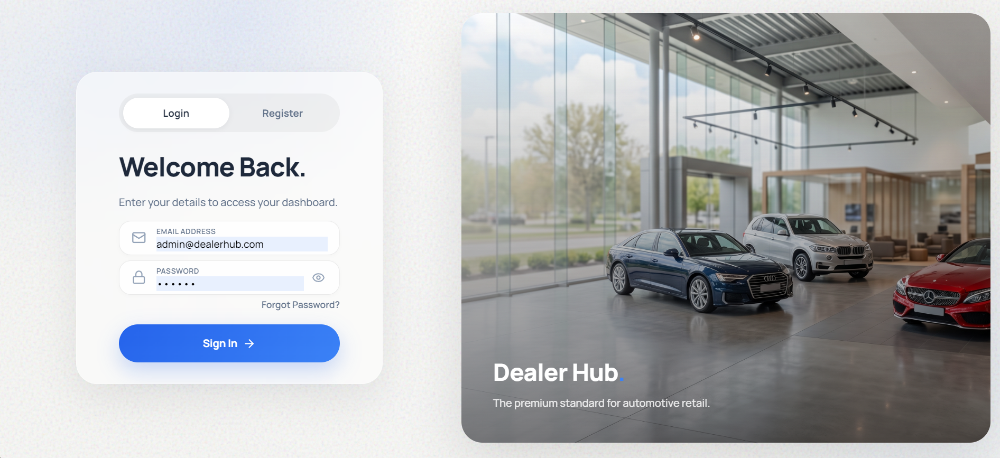
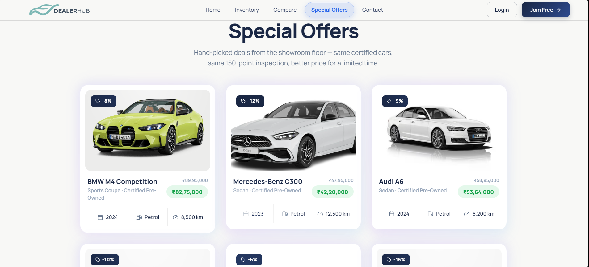
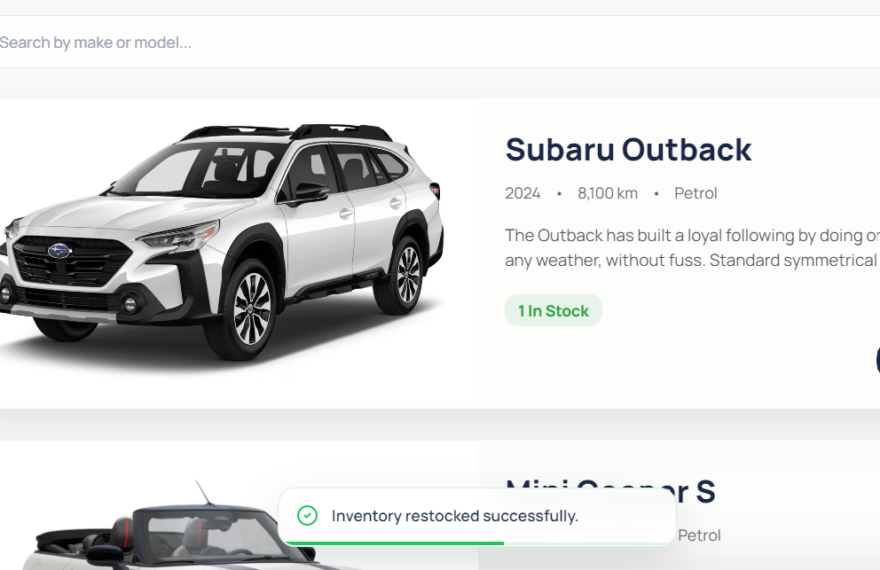

# Dealer Hub 🚗

A full-stack **Car Dealership Inventory System** — a premium digital showroom where customers browse, search, compare, and purchase cars, and admins manage the inventory end to end.

Built with **Node.js / Express + MongoDB (Mongoose)** on the backend and **React (Vite) + Tailwind CSS** on the frontend, with JWT-based authentication, strict Test-Driven Development, and a fully responsive UI down to phone sizes.



---

## What it does

**For visitors (logged out)**

- A cinematic landing page with a scroll-driven 3D car model, social proof, and clear CTAs
- A gated **Inventory teaser** — 3 real cars visible, the rest blurred behind a "sign in to take a tour of our garage" prompt
- A **Compare showcase** — two cars head-to-head with satisfaction stats, selling the compare-before-you-buy story
- A **Special Offers** page — demo cars with crossed-out prices, discount badges, and a specular-glow card design
- A **Contact** page and a register/login experience with a mode-aware form (`Join Free` lands on Register, `Login` on Login)

**For signed-in users**

- Dashboard with the full live inventory (list/grid views), search, filters, and sorting backed by the API
- Vehicle details with a **photo gallery** — thumbnail strip plus a full lightbox (keyboard navigation, wrap-around slides)
- **Compare up to 3 cars** side-by-side in a spec table
- **Purchase** with live stock enforcement (button disabled at zero stock) and toast feedback
- **My Purchases** — a receipts page with vehicle, price paid, and date & time of every purchase

**For admins**

- Add vehicles (with photo uploads stored in MongoDB), edit, delete, and restock — all enforced server-side, with the matching UI visible only to admins
- **Customer Orders** — a cross-customer purchase ledger with buyer names and emails
- The one admin account is bootstrapped from environment variables at server startup — registration can never create an admin

| | | |
|---|---|---|
|  |  |  |
|  |  |  |
|  |  |  |

---

## How it's structured

```
dealer_hub/
├── backend/
│   ├── app.js                 # Express app: middleware, routes, error handler
│   ├── server.js              # Entry point: env, DB connection, admin seed, listen
│   ├── models/                # Mongoose schemas: User, Vehicle, VehicleImage, Purchase
│   ├── controllers/           # Route handlers (auth, vehicles, purchases)
│   ├── routes/                # /api/auth, /api/vehicles, /api/purchases
│   ├── middleware/            # JWT `protect` + role-based `admin` guards
│   ├── scripts/               # seed.js (vehicles + photos), exportVehicles.js
│   ├── data/                  # Seed source of truth: car_data_full.json + car_images/
│   ├── utils/                 # seedAdminUser, helpers
│   └── tests/                 # Jest + Supertest + mongodb-memory-server suites
├── src/
│   ├── pages/                 # Landing, Inventory (+teaser), Details, Compare (+teaser),
│   │                          # Special Offers, Contact, Purchases, Admin Orders
│   ├── components/            # Auth, Navbar, Sidebar/DashboardLayout, VehicleCard,
│   │                          # VehicleGallery, SearchFilterBar, action buttons, Toast…
│   ├── context/               # CompareContext, ToastContext
│   ├── config/                # API base URL + image URL resolution
│   └── test/                  # Vitest setup (jsdom polyfills)
├── public/                    # 3D car model + the 6-car logged-out demo data/images
├── screenshots/               # Images used in this README
└── PROMPTS.md                 # Full AI-assisted workflow log (per session)
```

**Architecture notes**

- **The database owns everything**: vehicle data *and* photos live in MongoDB. Photos are stored as binary `VehicleImage` documents and served by `GET /api/vehicles/:id/images/:n` (the one deliberately public vehicle route — `` tags can't attach a JWT). The frontend `public/` folder keeps only a 6-car demo set for the logged-out teasers.
- **Purchases are receipts, not joins**: each purchase snapshots buyer and vehicle details plus the price paid at that moment, so history stays truthful even if a vehicle is later deleted or re-priced.
- **Roles are enforced server-side**: `protect` (JWT) and `admin` middleware guard every management endpoint; the client only *hides* what the server already forbids.

---

## Running it locally

### Prerequisites

- **Node.js 20+** and npm
- **MongoDB** — a local instance (`mongodb://localhost:27017`) or a MongoDB Atlas cluster

### 1. Clone and install

```bash
git clone https://github.com/indie-priyanshu12/dealer_hub.git
cd dealer_hub
npm install
```

One `package.json` covers both tiers — a single install sets up everything.

### 2. Configure environment

Create a **`.env.local`** file in the project root:

```env
# Database — omit to fall back to mongodb://localhost:27017/dealer_hub
MONGODB_URI=mongodb+srv://<user>:<password>@<cluster>/dealer_hub

# JWT signing secret (any long random string)
JWT_SECRET=change-me-to-something-long-and-random

# The single admin account, created automatically at server startup.
# Registration always creates regular users — this is the only way to get an admin.
ADMIN_EMAIL=admin@example.com
ADMIN_PASSWORD=a-strong-password
ADMIN_NAME=Showroom Admin

# Optional
PORT=5000                       # backend port (default 5000)
# CLIENT_URL=https://your-frontend.example   # locks CORS in production
```

### 3. Seed the database

```bash
node backend/scripts/seed.js
```

This loads **20 vehicles and 101 photos** (stored in MongoDB as binary documents) from `backend/data/`. Safe to re-run — it resets the vehicle and photo collections each time. Point `MONGODB_URI` at a production cluster to seed a deployment the same way.

### 4. Start the backend

```bash
npm start
```

Runs the API at `http://localhost:5000` and bootstraps the admin account from the env vars (a no-op once it exists).

### 5. Start the frontend

In a second terminal:

```bash
npm run dev
```

Opens the app at `http://localhost:5173`. In development, Vite proxies `/api/*` to the backend automatically — no extra config needed.

> **Deploying?** Build with `npm run build`. A deployed frontend needs `VITE_API_BASE_URL` set to the backend's public URL at build time, and the backend should set `CLIENT_URL` (CORS) plus the same `MONGODB_URI` / `JWT_SECRET` / `ADMIN_*` variables.

---

## API overview

**Auth (public)**

| Method | Endpoint | Description |
|---|---|---|
| POST | `/api/auth/register` | Register (always as a regular User) |
| POST | `/api/auth/login` | Log in, receive a JWT |

**Vehicles**

| Method | Endpoint | Description | Access |
|---|---|---|---|
| GET | `/api/vehicles` | List all vehicles | Authenticated |
| GET | `/api/vehicles/search` | Search / filter / sort | Authenticated |
| GET | `/api/vehicles/:id` | Single vehicle | Authenticated |
| GET | `/api/vehicles/:id/images/:n` | Serve a stored photo | Public (see note) |
| POST | `/api/vehicles` | Add a vehicle (accepts base64 `imageUploads`) | **Admin** |
| PUT | `/api/vehicles/:id` | Update a vehicle | **Admin** |
| DELETE | `/api/vehicles/:id` | Delete a vehicle | **Admin** |
| POST | `/api/vehicles/:id/purchase` | Purchase (stock −1, records a receipt) | Authenticated |
| POST | `/api/vehicles/:id/restock` | Restock (stock +n) | **Admin** |

**Purchases**

| Method | Endpoint | Description | Access |
|---|---|---|---|
| GET | `/api/purchases/mine` | Caller's purchase history | Authenticated |
| GET | `/api/purchases` | All customers' purchases | **Admin** |

---

## Testing

Everything was built **test-first** (Red → Green → Refactor) — the commit history shows the cycle per feature.

```bash
npm test                # backend + frontend
npm run test:backend    # Jest + Supertest + mongodb-memory-server
npm run test:frontend   # Vitest + React Testing Library
```

### Test report

**163 / 163 passing** (latest full run):

| Suite | Framework | Files | Tests |
|---|---|---|---|
| Backend API & models | Jest + Supertest (in-memory MongoDB) | 8 | **72** |
| Frontend components & pages | Vitest + React Testing Library | 15 | **91** |
| **Total** | | **23** | **163** |

Coverage highlights: every endpoint's happy path, auth failures (401/403), validation errors (400), business rules (out-of-stock purchase, duplicate IDs, role escalation attempts, purchase receipts), and frontend behavior from the photo gallery's keyboard navigation to the mobile drawer and role-based sidebar.

---

## My AI Usage

_To be written — see [PROMPTS.md](PROMPTS.md) for the complete per-session AI workflow log in the meantime._

<!--
TODO (per requirements §3.4.2):
1. Which AI tools were used
2. How they were used — concrete examples
3. Reflection: what worked, what didn't, where the AI had to be overridden or corrected
-->
